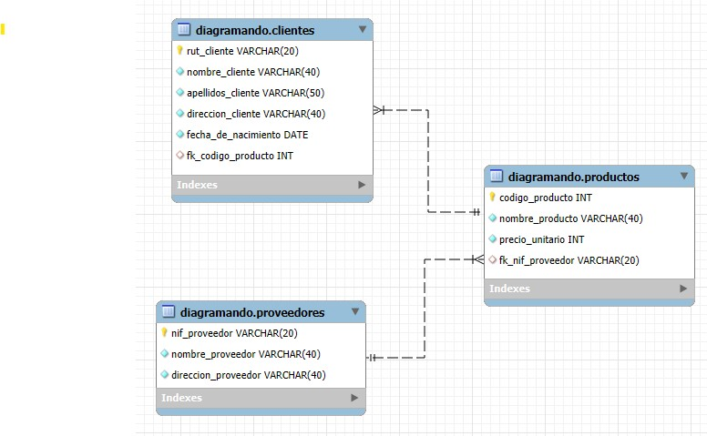
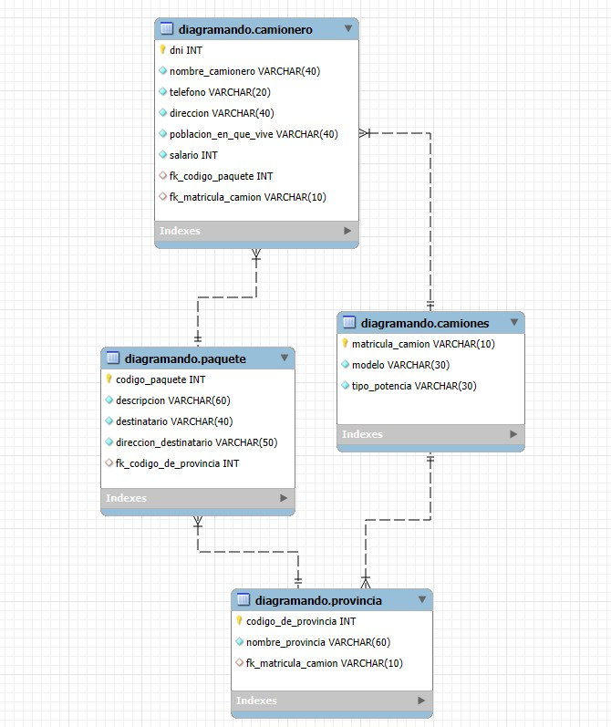
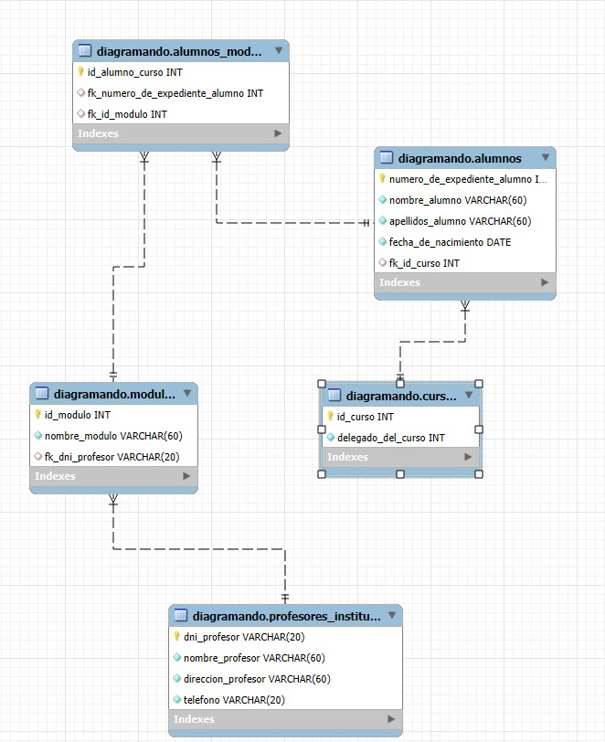
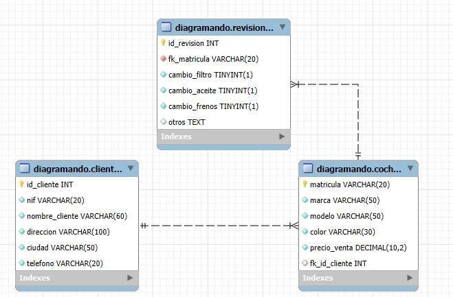
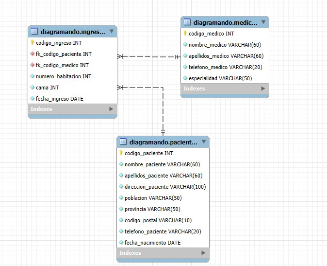

**_<h1 align="center">:vulcan_salute: Ejercicio Grupal 5 :computer:</h1>_**
**_<h2 align="center">Módulo 3 - Fundamentos de Bases de Datos Relacionales</h2>_**

- Diagramas de acuerdo a información entregada
- Ejercicio 1:

- Ejercicio 2:

- Ejercicio 3:

- Ejercicio 4:

- Ejercicio 5:

